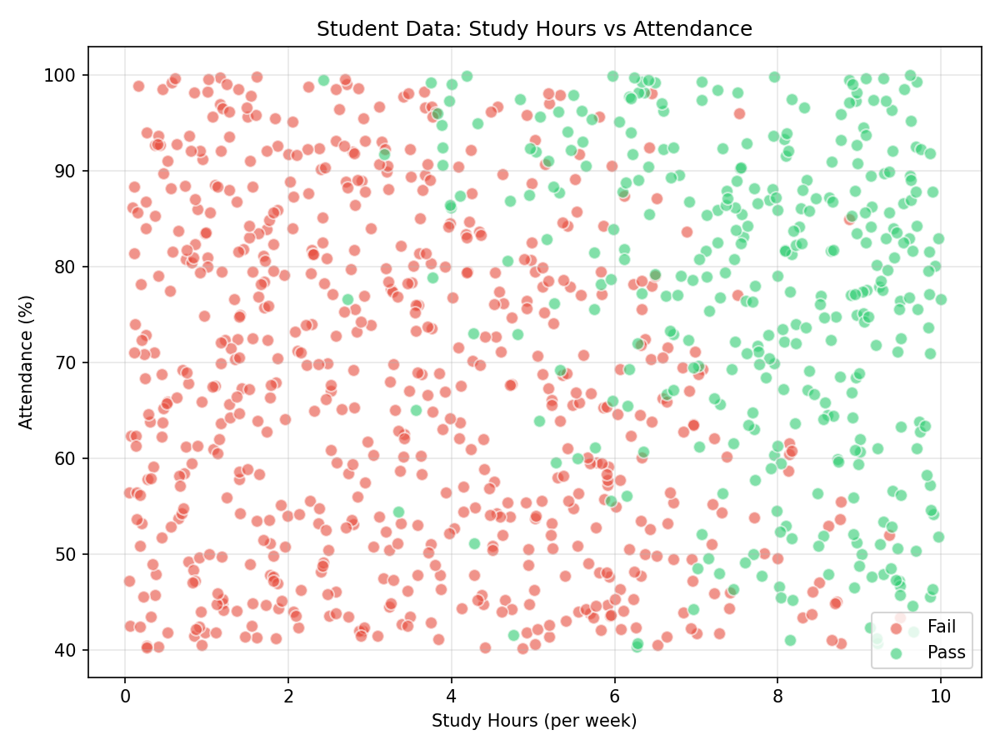
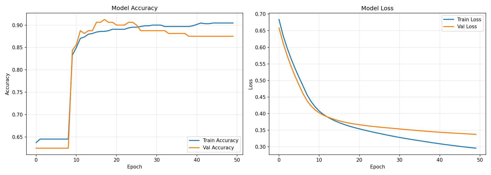
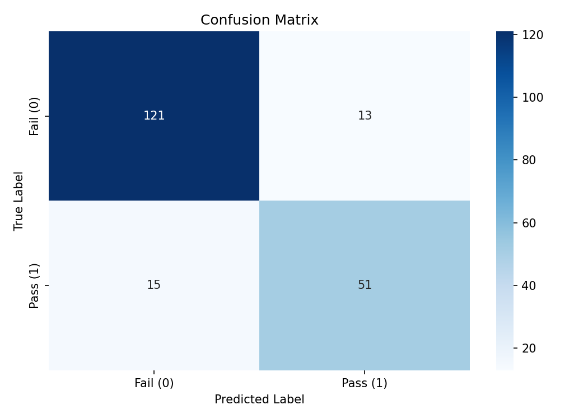

# Student Performance Prediction 🎓

A deep learning project using **Keras/TensorFlow** to predict student academic success (Pass/Fail) based on study habits and attendance.

## 📊 Overview
This project demonstrates a complete machine learning pipeline:
1.  **Synthetic Data Generation**: Creating a realistic dataset reflecting academic patterns.
2.  **Data Preprocessing**: Scaling and normalizing features for neural network compatibility.
3.  **Neural Network Modeling**: Building a multi-layer perceptron (ANN) with Keras.
4.  **Evaluation**: Analyzing results with confusion matrices and classification reports.
5.  **Visualization**: Generating learning curves and data distribution plots.

## 🚀 Getting Started

### Prerequisites
- Python 3.8+
- pip

### Installation
1. Clone the repository:
   ```bash
   git clone https://github.com/vajihvu/student-performance-prediction.git
   cd student-performance-prediction
   ```
2. Install dependencies:
   ```bash
   pip install -r requirements.txt
   ```

### Usage
Run the main prediction script:
```bash
python student_performance_prediction.py
```

## 📈 Visualizations
The model generates several plots to evaluate performance:

### 1. Data Distribution
Shows the relationship between Study Hours, Attendance, and the resulting Pass/Fail outcome.


### 2. Learning Curves
Tracks Accuracy and Loss over 50 training epochs.


### 3. Confusion Matrix
Displays the precision of predictions for both classes.


## 📂 Project Structure
- `student_performance_prediction.py`: Main Python script.
- `student_performance_report.md`: Detailed technical report.
- `requirements.txt`: List of dependencies.
- `*.png`: Evaluation plots.
- `student_performance_model.keras`: Saved trained model.

## 🛠️ Built With
- **TensorFlow/Keras** - Deep Learning Framework
- **Scikit-Learn** - Preprocessing & Metrics
- **Pandas/NumPy** - Data Manipulation
- **Matplotlib/Seaborn** - Data Visualization
